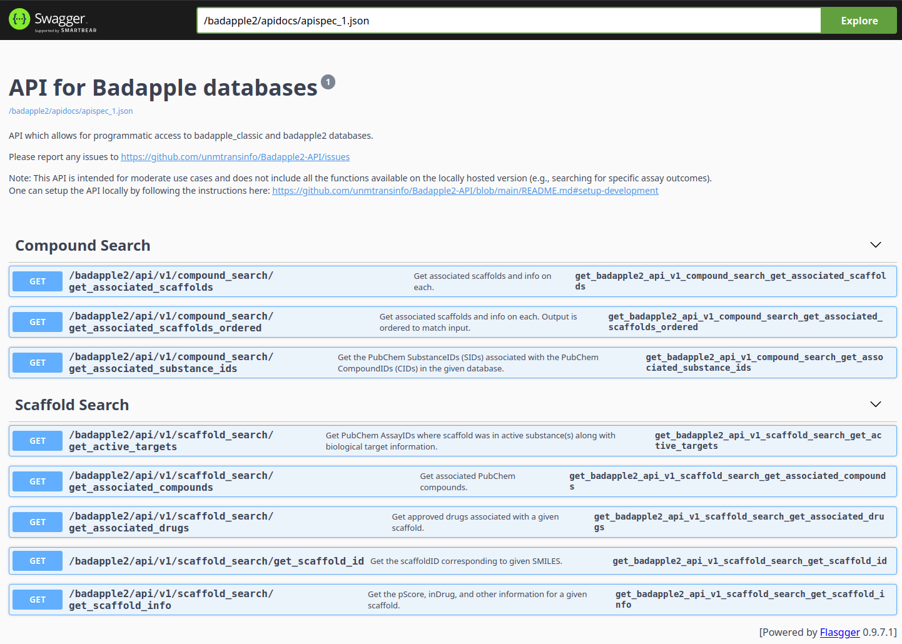

# Badapple2-API



API code for [Badapple2](https://github.com/unmtransinfo/Badapple2). The repo also containers docker compose files which can be used to setup the entire project (including DBs, API, and UI).

For moderate use cases (<10,000 compounds / day) one can use the public API:
https://chiltepin.health.unm.edu/badapple2/apidocs/

For large input files, local installation is recommended. See [Setup (Local Installation)](#setup-local-installation) below.

## Requirements

- Docker
- Docker Compose

## Setup (Local Installation)

The steps below will install the databases (badapple_classic + badapple2), API, and UI on your system.

1. Install docker engine: https://docs.docker.com/engine/install/
2. (Optional) modify [local.env](local.env)
   - If you want to include activity outcomes ("activity" table), you will need to change `DB_IMAGE_TAG` to "badapple_classic-full" and `DB2_IMAGE_TAG` to "badapple2-full".
   - Note that if you do not include activity outcomes then you will be unable to use the `substance_search/get_assay_outcomes` API call.
3. Run `docker compose -f docker-compose.local.yml --env-file local.env up --build -d`
4. The DBs, API, and UI will be accessible as follows:
   - UI: http://localhost:8080/badapple2/
   - API: http://localhost:8000/apidocs/
   - badapple_classic: `psql -d badapple_classic -p 5433 -U toad -h localhost` (password: "road")
   - badapple2: `psql -d badapple2 -p 5434 -U frog -h localhost` (password: "lilyPad")

### Benchmark (Local Installation)

On a laptop computer without parallelization the `compound_search/get_associated_scaffolds_ordered` endpoint processed all 2,474,590 ChEMBL (version 35) compounds in 5.75 hours, processing roughly 120 compounds/second. YMMV depending on your system specs, how you setup gunicorn (`n_workers`) + use of parallelization, as well as your input dataset (compounds with more ring systems take more time to process). See the [benchmark/](benchmark/) directory for more info.

## Documentation

The `/apidocs/` page will provide you with detailed information on every API call available. Note that the local version includes some functions not available on the production server.

See links below for documentation on the production and local version of the API:

- Production: https://chiltepin.health.unm.edu/badapple2/apidocs/
- Local: http://localhost:8000/apidocs/

## Usage

One can use the API to access Badapple programmatically. For example, using the `requests` Python package one can fetch the scaffolds associated with some given compounds (SMILES):

```
import requests
import json

SMILES_list = ["CN1C(=O)N(C)C(=O)C(N(C)C=N2)=C12", "COc1cc2c(ccnc2cc1)C(O)C4CC(CC3)C(C=C)CN34"]
database = "badapple2"
max_rings = 5
API_URL = "http://localhost:8000/api/v1/compound_search/get_associated_scaffolds"
response = requests.get(
                API_URL,
                params={
                    "SMILES": SMILES_list,
                    "database": database,
                    "max_rings": max_rings,
                },
            )
data = json.loads(response.text)
print(data)
# {'CN1C(=O)N(C)C(=O)C(N(C)C=N2)=C12': [{'id': 534, 'in_db': True, 'in_drug': True, 'kekule_scafsmi': 'O=C1NC(=O)C2=C(N=CN2)N1', 'nass_active': 627, 'nass_tested': 896, 'ncpd_active': 2018, 'ncpd_tested': 8040, 'ncpd_total': 8040, 'nsam_active': 7527, 'nsam_tested': 1455517, 'nsub_active': 2201, 'nsub_tested': 12574, 'nsub_total': 12574, 'prank': 5593, 'pscore': 37.0, 'scafsmi': 'O=c1[nH]c(=O)c2[nH]cnc2[nH]1', 'scaftree': '534'}]}
```

Additional examples can be seen in the [example_scripts/](example_scripts/) subdirectory.

## Setup (Development)

1. Install the badapple_classic and badapple2 DBs by following the instructions [here](https://github.com/unmtransinfo/Badapple2/blob/main/README.md)
2. Copy [.env.example](app/.env.example) to `.env` (in the `/app` folder): `cp .env.example .env`
3. Edit the `.env` credentials as needed
4. Run `docker compose --env-file ./app/.env -f docker-compose.dev.yml up --build`
   - Note: Depending on your version of docker, you may instead want to use: `docker-compose --env-file ./app/.env -f docker-compose.dev.yml up --build`
5. The API should now be accessible from `localhost:8000`
   - A full set of Swagger documentation can be found at http://localhost:8000/apidocs

### Development Notes

#### Upgrading Dependencies

If one finds they need to update dependencies (`requirements.txt`), the following steps can be followed:

1. If a new package is required, add it to `requirements.in`
2. Setup and activate a Python (v3.12) virtual environment. For example, with conda use:
   ```
   conda create -n badapple2-api python=3.12 && conda activate badapple2-api
   ```
3. Install pip-tools: `pip install pip-tools`
4. Compile new requirements: `pip-compile --upgrade`
   - Make sure you are in the `app/` directory: `cd app/`
5. (Optional) Test the update locally in your environment: `pip-sync`

_Note_: If you need to update the Python version, make sure to adjust the steps above accordingly and to update the Python image in `Dockerfile`.

#### Code Formatting with Pre-commit Hooks

This project uses [pre-commit](https://pre-commit.com/) hooks to automatically format Python code with [Black](https://black.readthedocs.io/) and formats/checks Docker Compose files with [DCLint](https://github.com/zavoloklom/docker-compose-linter/tree/main) before each commit.

**Setup (one-time):**

1. Setup and activate a Python (v3.14) virtual environment if you haven't already:

   ```bash
   conda create -n badapple2-api python=3.12 && conda activate badapple2-api
   ```

2. Install dependencies:

   ```bash
   pip install -r app/requirements.txt
   ```

3. Install the pre-commit hooks:
   ```bash
   pre-commit install
   ```

**Running hooks manually:**

You can run all pre-commit hooks manually without committing:

```bash
pre-commit run --all-files
```

## Setup (Production on Chiltepin)

1. **Pull latest changes (for compose file mainly):**

```bash
git pull
```

2. **Copy [.env.prod.example](.env.prod.example) to `.env`**:

```bash
cp .env.prod.example .env
```

2. **Modify `.env`**
3. **(If significant changes to compose file):**

   ```bash
   docker compose -f docker-compose.prod.yml down
   ```

4. **Pull latest images and run:**

   ```bash
   docker compose -f docker-compose.prod.yml pull
   docker compose -f docker-compose.prod.yml up -d --remove-orphans
   ```

5. **Verify deployment:**

   ```bash
   docker compose -f docker-compose.prod.yml ps
   docker compose -f docker-compose.prod.yml logs api
   ```

## Acknowledgment

Originally forked from the CFChemAPI repo:
[https://github.com/unmtransinfo/CFChemAPI](https://github.com/unmtransinfo/CFChemAPI)
