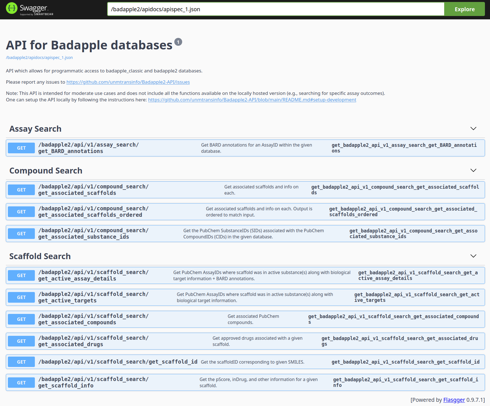

# Badapple2-API



API code for [Badapple2](https://github.com/unmtransinfo/Badapple2). The repo also containers docker compose files which can be used to setup the entire project (including DBs, API, and UI).

For moderate use cases (<10,000 compounds / day) one can use the public API:
https://chiltepin.health.unm.edu/badapple2/apidocs/

For large input files, local installation is recommended. See [Setup (Local Installation)](#setup-local-installation) below.

## Requirements

- Docker
- Docker Compose

## Setup (Local Installation)

The steps below will install the databases (badapple_classic + badapple2), API, and UI on your system.

1. Install docker engine: https://docs.docker.com/engine/install/
2. (Optional) modify [local.env](local.env)
   - If you want to include activity outcomes ("activity" table), you will need to change `DB_PGDUMP_URL` to "https://unmtid-dbs.net/download/Badapple2/badapple_classic_full.pgdump" and `DB2_PGDUMP_URL` to "https://unmtid-dbs.net/download/Badapple2/badapple2_full.pgdump"
   - Note that if you do not include activity outcomes then you will be unable to use the `substance_search/get_assay_outcomes` API call.
3. Run `docker compose -f compose-local.yml --env-file local.env up --build -d`
4. The DBs, API, and UI will be accessible as follows:
   - UI: http://localhost:8080/badapple2/
   - API: http://localhost:8000/apidocs/
   - badapple_classic: `psql -d badapple_classic -p 5432 -U toad -h localhost` (password: "road")
   - badapple2: `psql -d badapple2 -p 5433 -U frog -h localhost` (password: "lilyPad")

### Benchmark (Local Installation)

On a laptop computer without parallelization the `compound_search/get_associated_scaffolds_ordered` endpoint processed all 2,474,590 ChEMBL (version 35) compounds in 5.75 hours, processing roughly 120 compounds/second. YMMV depending on your system specs, how you setup gunicorn (`n_workers`) + use of parallelization, as well as your input dataset (compounds with more ring systems take more time to process). See the [benchmark/](benchmark/) directory for more info.

## Documentation

The `/apidocs/` page will provide you with detailed information on every API call available. Note that the local version includes some functions not available on the production server.

See links below for documentation on the production and local version of the API:

- Production: https://chiltepin.health.unm.edu/badapple2/apidocs/
- Local: http://localhost:8000/apidocs/

## Usage

One can use the API to access Badapple programmatically. For example, using the `requests` Python package one can fetch the scaffolds associated with some given compounds (SMILES):

```
import requests
import json

SMILES_list = ["CN1C(=O)N(C)C(=O)C(N(C)C=N2)=C12", "COc1cc2c(ccnc2cc1)C(O)C4CC(CC3)C(C=C)CN34"]
database = "badapple2"
max_rings = 5
API_URL = "http://localhost:8000/api/v1/compound_search/get_associated_scaffolds"
response = requests.get(
                API_URL,
                params={
                    "SMILES": SMILES_list,
                    "database": database,
                    "max_rings": max_rings,
                },
            )
data = json.loads(response.text)
print(data)
# {'CN1C(=O)N(C)C(=O)C(N(C)C=N2)=C12': [{'id': 534, 'in_db': True, 'in_drug': True, 'kekule_scafsmi': 'O=C1NC(=O)C2=C(N=CN2)N1', 'nass_active': 627, 'nass_tested': 896, 'ncpd_active': 2018, 'ncpd_tested': 8040, 'ncpd_total': 8040, 'nsam_active': 7527, 'nsam_tested': 1455517, 'nsub_active': 2201, 'nsub_tested': 12574, 'nsub_total': 12574, 'prank': 5593, 'pscore': 37.0, 'scafsmi': 'O=c1[nH]c(=O)c2[nH]cnc2[nH]1', 'scaftree': '534'}]}
```

Additional examples can be seen in the [example_scripts/](example_scripts/) subdirectory.

## Setup (Development)

1. Install the badapple_classic and badapple2 DBs by following the instructions [here](https://github.com/unmtransinfo/Badapple2/blob/main/README.md)
2. Copy [.env.example](app/.env.example) to `.env` (in the `/app` folder): `cp .env.example .env`
3. Edit the `.env` credentials as needed
4. Run `docker compose --env-file ./app/.env -f compose-development.yml up --build`
   - Note: Depending on your version of docker, you may instead want to use: `docker-compose --env-file ./app/.env -f compose-development.yml up --build`
5. The API should now be accessible from `localhost:8000`
   - A full set of Swagger documentation can be found at http://localhost:8000/apidocs

### Development Notes

#### Upgrading Dependencies

If one finds they need to update dependencies (`requirements.txt`), the following steps can be followed:

1. If a new package is required, add it to `requirements.in`
2. Setup and activate a Python (v3.12) virtual environment. For example, with conda use:
   ```
   conda create -n badapple2-api python=3.12 && conda activate badapple2-api
   ```
3. Install pip-tools: `pip install pip-tools`
4. Compile new requirements: `pip-compile --upgrade`
   - Make sure you are in the `app/` directory: `cd app/`
5. (Optional) Test the update locally in your environment: `pip-sync`

_Note_: If you need to update the Python version, make sure to adjust the steps above accordingly and to update the Python image in `Dockerfile`.

## Setup (Production on Chiltepin)

1. Copy [production_env.example](production_env.example) to `.env`: `cp production_env.example .env`
2. Fill in/edit the `.env` credentials as needed
3. Update apache2 config:
   - Create a new file for apache2 config: `/etc/apache2/sites-available/badapple2api.conf`
   - Add the following line to `/etc/apache2/apache2.conf`:
     ```
     Include /etc/apache2/sites-available/badapple2api.conf
     ```
   - Update the apache2 virtual config file: `/etc/apache2/sites-enabled/000-default.conf`
   - Run config check: `sudo apachectl configtest`
   - (If config check passed) reload apache: `sudo systemctl reload apache2`
4. (If server was previously up): `docker-compose -f compose-production.yml down`
5. Run `docker-compose -f compose-production.yml up --build -d`

If you only need to update a single service (e.g., the UI) you don't need to do a full restart (with `down` + `up`). Instead, you can use this approach:

1. Run `docker-compose -f compose-production.yml build badapple_ui`
2. Then `docker-compose -f compose-production.yml up badapple_ui`
3. (Recommended) Restart nginx: `docker-compose -f compose-production.yml restart badapple_nginx`

### Production notes

- If you are noticing some UI changes not showing up you may need to clear your browser cache
- You will likely need to clear the docker cache if you've made changes to the DB
- If you've pushed changes to the UI and docker is still using the cached github context, try changing UI build context to either a specific branch or commit. See https://docs.docker.com/reference/compose-file/build/#attributes for more info.
- In extreme cases you may need to go in and manually override the DB. I still do not know what the reason is for this, but there are times when even after updating the .pgdump file the DB state will not be changed (even after clearing cache etc). These steps are what I've found work:

1. Connect to the DB container: `docker exec -it <container_id> sh`
2. (If necessary) re-download the .pgdump file. For example:

```
wget --no-cache -O /tmp/badapple_classic.pgdump https://unmtid-dbs.net/download/Badapple2/badapple_classic.pgdump
```

3. Change to postgres user: `sudo -i -u postgres`
4. Run pg_restore on the DB with the .pgdump file:

```
pg_restore --clean -O -x -v -d ${DB_NAME} <PATH_TO_PGDUMP_FILE>
```

5. Grant privileges back to DB_USER:

```
psql -p ${DB_PORT} -d ${DB_NAME} -c "GRANT SELECT ON ALL TABLES IN SCHEMA public TO ${DB_USER}"
psql -p ${DB_PORT} -d ${DB_NAME} -c "GRANT SELECT ON ALL SEQUENCES IN SCHEMA public TO ${DB_USER}"
psql -p ${DB_PORT} -d ${DB_NAME} -c "GRANT EXECUTE ON ALL FUNCTIONS IN SCHEMA public TO ${DB_USER}"
```

6. Exit DB container.

## Acknowledgment

Originally forked from the CFChemAPI repo:
[https://github.com/unmtransinfo/CFChemAPI](https://github.com/unmtransinfo/CFChemAPI)
